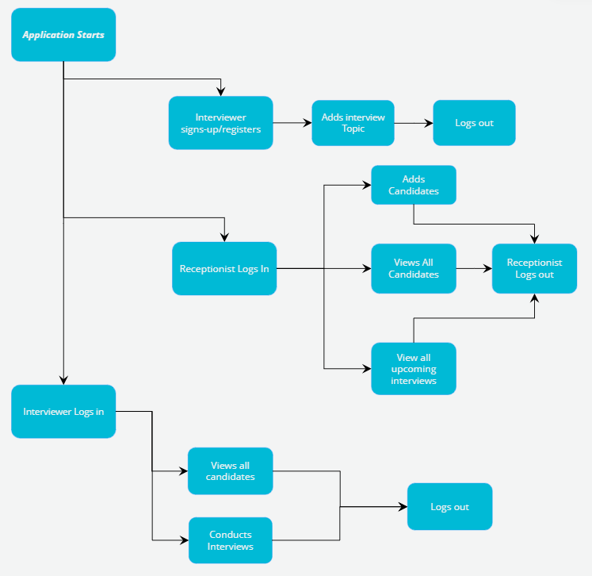
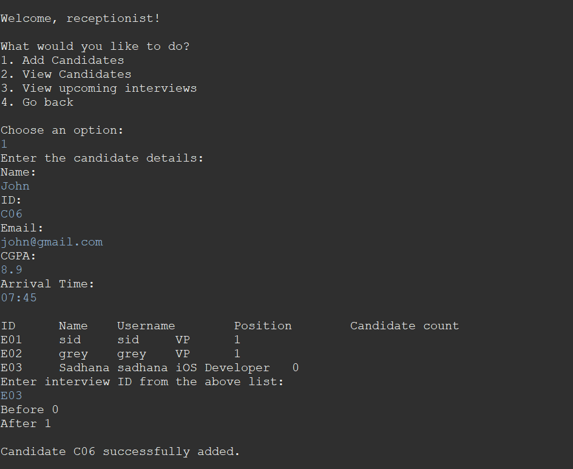
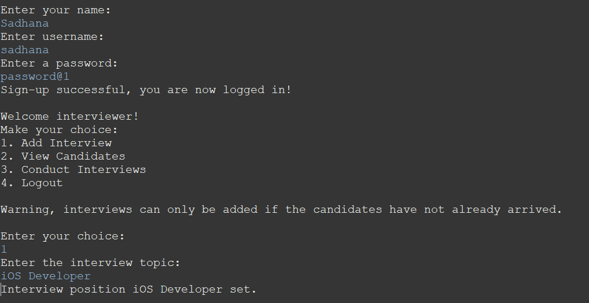
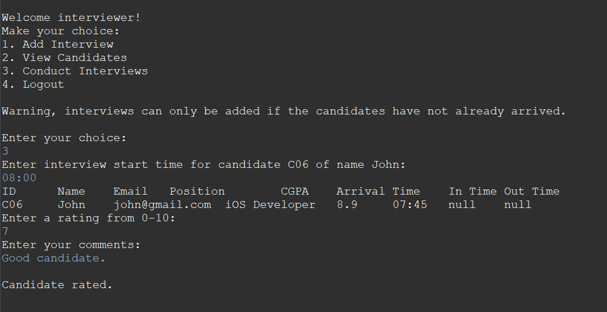
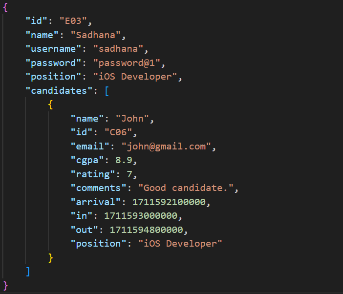

# Interview-Panel-Application
## About the Project
- Type: B2B
- Target Audience: Interviewers, receptionists
- This project is a console application made entirely from Java. It is aimed towards companies in order to make interviewing an easier process. This project helps the company store candidate data, log candidate records, rate/comment on an interview, etc. It is a simple application where multiple interviewers can conduct interviews and rate candidates. 

## Built With
- Java
- JSON to store data

## Usage
Given below is the flow of the application.

